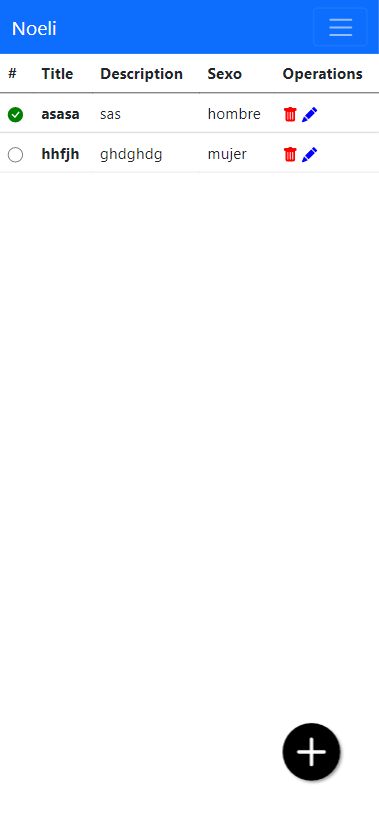

# Tecnologías utilizadas
NodeJS -> Nucleo de programación

Expres -> WS

## Front-end
HTML
CSS
JS

Home             |  List
:-------------------------:|:-------------------------:
  |  

Express & Handlebars(es HTML con codigo de programación)

mongoose -> conexion a la DB MongoDB

nodemon -> Demonio para servicios

Babel -> compilador JS

morgan -> Verifica as acciones del servidor

# Estructura del proyecto
## Proyecto
node-module <- npm i

    .hbs remplaza a .html

## **src**:
- routes
- **views**
- routes
- models
- layouts
- controller
